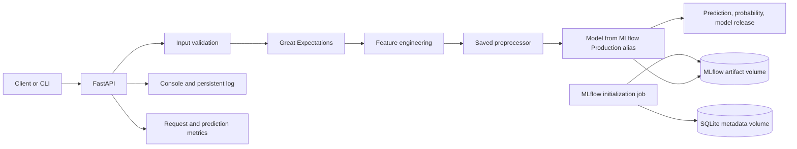

# تقرير Task 3: تحويل نموذج Olist إلى خدمة Inference

**إعداد:** ........................................

**المساق:** MLOps Training 2026/2027

**التاريخ:** 2026-10-03

## 1. مقدمة وهدف المشروع

في Task 2 درّبت نموذجًا للتنبؤ إذا كان طلب Olist سيتأخر في التسليم. في Task 3 جهّزت المشروع لاستخدام النموذج بعد التدريب: أرسل بيانات طلب جديد، فيتحقق النظام منها، يبني الميزات نفسها المستخدمة في التدريب، ثم يرجع التنبؤ واحتمال التأخير.

هذا المشروع ينفذ **inference فقط**. التدريب واختيار threshold بقيا في notebooks الخاصة بـTask 2. أثناء التنبؤ أحمّل الـpreprocessor والـmodel المحفوظين؛ لا أعيد تدريب النموذج أو `fit` للـencoders والـscalers.

راجعت ورقة متطلبات Task 3. الورقة تحدد مخرجات العمل وطريقة إثباتها، لكنها لا تحدد صيغة أو منصة تسليم بعينها. اخترت توثيق المشروع على GitHub كما هو موضح في هذا التقرير. يجب إضافة ملفات المشروع الجديدة وملفات inference الظاهرة في Git إلى commit قبل رفع المستودع.

## 2. تصميم النظام



يستخدم Docker Compose ثلاث خدمات: `mlflow`، و`mlflow-init`، و`api`. يخزن MLflow بياناته الوصفية في SQLite داخل volume اسمه `mlflow_db`، والـartifacts في `mlflow_artifacts`. يسجل `mlflow-init` النموذج ويضع alias باسم `Production`. لا توجد خدمة PostgreSQL منفصلة في ملف Compose الأساسي. تحفظ سجلات API في volume اسمه `api_logs`.

## 3. هيكل المشروع

```text
Qafza_Task_2/
├── app/
│   └── main.py                 # FastAPI routes, schemas, startup, logging, metrics
├── artifacts/                  # Model, fitted preprocessor, threshold, feature lists
│   ├── final_logistic_model_experiment2.joblib
│   ├── preprocessor_experiment2.joblib
│   ├── final_threshold_experiment2.json
│   └── *.dvc                    # DVC metadata for versioned outputs
├── config/
│   └── config.yaml              # Paths, model info, threshold, logging, monitoring
├── data/                        # Project data directory
├── docs/
│   └── Task3_Report.md          # This report
├── notebooks/                   # Task 2 exploration, feature engineering and training
├── olist db/                    # Source Olist CSV datasets, including geolocation
├── requirements/
│   ├── requirements-prod.txt    # Runtime dependencies
│   ├── requirements-dev.txt     # Test, lint and development dependencies
│   └── requirements.txt         # Existing Task 2 dependency file
├── src/
│   ├── cli.py                   # JSON/stdin inference command
│   ├── data.py                  # CSV and geolocation loading
│   ├── data_validation.py       # Great Expectations checks
│   ├── features.py              # Inference-time feature engineering
│   ├── mlflow_tracking.py       # Experiment logging and model registration
│   ├── monitoring.py            # In-process counters, latency and drift calculation
│   ├── pipeline.py              # End-to-end inference orchestration
│   ├── prediction.py            # Model probabilities and thresholding
│   ├── preprocessing.py         # Load and apply the fitted preprocessor
│   └── validation.py            # Basic request validation
├── tests/                       # Unit, data, CLI, monitoring and API tests
├── .dvc/                        # DVC configuration and local cache metadata
├── .github/workflows/ci.yml     # GitHub Actions checks and image publishing
├── .pre-commit-config.yaml      # Ruff hooks before commits
├── docker-compose.yml           # MLflow, initialization and API services
├── Dockerfile                   # Python inference image
└── README.md                    # Project setup and usage
```

## 4. مسار التنبؤ

1. يستقبل `/predict` طلبًا واحدًا، أو يستقبل `/predict-batch` قائمة طلبات.
2. يتحقق Pydantic من schema وأنواع وقيم حقول الطلب، مثل منع القيم السالبة.
3. تتحقق `validate_order` من الحقول الأساسية والأرقام والولايات والتواريخ.
4. يفحص Great Expectations تطابق أعمدة الإدخال، الحدود الدنيا للأرقام، الولايات المسموحة، والقيم غير الفارغة للحقول المحددة. عند فشل التحقق يرجع النظام خطأ واضحًا ولا يمرر البيانات للنموذج.
5. تبني `build_features` الميزات الزمنية والجغرافية، ومنها `estimated_delivery_days` و`approval_delay_hours` و`distance_km` و`same_state`.
6. يحمّل `prepare_features` الـpreprocessor المحفوظ من Task 2 ويستخدم `transform` فقط.
7. يحمل الـAPI النموذج المسجل في MLflow من alias `Production`.
8. تحسب `predict` احتمال الفئة `Late` وتستخدم threshold `0.35` لإرجاع `Late` أو `On Time`.
9. تسجل الخدمة المدخلات والنتيجة والوقت وإصدار الخدمة في log.

تستخدم نسخة Experiment 2 عشرين feature خامًا، ويحوّلها الـpreprocessor إلى 84 feature معالجة. فحصت أول صف من test split بعد استخدام أعمدة الإدخال الصحيحة: الفرق الأقصى بين الميزات المعالجة في inference ومصفوفة Task 2 المحفوظة كان `0`، والفرق بين احتمالي النموذج كان `0` أيضًا.

## 5. الإعدادات والنسخ

أضع الإعدادات القابلة للتغيير في `config/config.yaml` بدل توزيعها بين الملفات:

| الإعداد | القيمة الحالية | الاستخدام |
|---|---:|---|
| اسم النموذج | `logistic_regression` | اسم النموذج في معلومات الخدمة |
| إصدار الخدمة | `1.0.0` | القيمة التي ترجعها API مع التنبؤ |
| threshold | `0.35` | الحد الفاصل بين `Late` و`On Time` |
| baseline للتأخير | `0.27448` | مرجع مراقبة توزيع التنبؤات |
| أقل عدد للتنبؤات | `100` | لا يحسب تنبيه drift قبله |
| حد تغير المعدل | `0.10` | فرق مطلق قدره 10 نقاط مئوية |
| log file | `logs/predictions.log` | ملف سجل inference |

أستخدم DVC metadata (`.dvc` files) لتتبع مخرجات Task 2. على هذا الجهاز أعاد `dvc status` النتيجة `Data and pipelines are up to date.`. لا يوجد DVC remote مشترك حاليًا؛ لذلك الملفات الكبيرة التي بقيت DVC-only لا يمكن تنزيلها تلقائيًا على جهاز آخر. ملفات inference الأربعة صغيرة ومسموح بها في Git حتى يمكن بناء صورة Docker وتشغيل الاختبارات من clone جديد بعد إضافتها إلى commit.

## 6. MLflow وDocker Compose

يسجل `src/mlflow_tracking.py` run في experiment باسم `Olist Late Delivery - Experiment 2`. يسجل نوع النموذج واسم التجربة وعدد الميزات والـthreshold، إلى جانب مقاييس Task 2 والـpreprocessor والـthreshold وقائمة الميزات. بعدها يسجل النموذج في registry باسم `olist_late_delivery_model` ويضبط alias `Production` على أحدث version.

في الحالة التي فحصتها كان MLflow registry يعرض version `5` تحت alias `Production`. ترجع API `1.0.0` كإصدار الخدمة من config؛ هاتان قيمتان مختلفتان. حملت API النموذج من registry، وأظهرت logs تنزيل artifacts من MLflow، وحالة `olist-mlflow` كانت `healthy`.

للتشغيل من جذر المشروع بعد تثبيت Docker Desktop:

```powershell
docker compose up -d --build
docker compose ps -a
docker compose logs --tail=100 mlflow
```

يستخدم `--build` عند أول تشغيل أو عند تغيير Dockerfile/dependencies. بعد ذلك يمكن تشغيل `docker compose up -d`. لا تستخدم أوامر حذف volumes عند إعادة التشغيل؛ الـvolumes تحفظ قاعدة MLflow وartifacts وسجلات API.

للتحقق من الخدمة:

```powershell
Invoke-RestMethod http://localhost:8000/health
Invoke-RestMethod http://localhost:8000/model-info
Invoke-RestMethod http://localhost:8000/metrics
```

توثيق OpenAPI وتجربة الطلبات متاحان على `http://localhost:8000/docs`، وواجهة MLflow على `http://localhost:5000`.

## 7. أمثلة على API وCLI

مثال طلب فردي مطابق للـschema:

```json
{
  "item_count": 1,
  "total_price": 100.0,
  "total_freight": 20.0,
  "payment_count": 1,
  "total_payment": 120.0,
  "payment_installments": 1,
  "unique_products": 1,
  "average_product_weight": 500.0,
  "average_product_photos": 3.0,
  "customer_state": "SP",
  "seller_state": "SP",
  "customer_zip_code_prefix": 1000,
  "seller_zip_code_prefix": 1100,
  "order_purchase_timestamp": "2018-01-01 10:00:00",
  "order_approved_at": "2018-01-01 10:30:00",
  "order_estimated_delivery_date": "2018-01-10"
}
```

الطلب يرسل إلى `POST /predict`. النتيجة التي تحققت منها فعليًا كانت:

```json
{
  "prediction": "Late",
  "late_probability": 0.5122373483411538,
  "model_version": "1.0.0"
}
```

أما `POST /predict-batch` فيستقبل JSON array مباشرة، مثل `[order1, order2]`، وليس object يحتوي `orders`. استخدمت الطلب نفسه مرتين وتأكدت أن الاستجابة تضمنت نتيجتين.

يدعم CLI ملف JSON أو stdin. مثال stdin داخل حاوية API:

```powershell
Get-Content .\order.json -Raw | docker compose exec -T api python -m src.cli -
```

## 8. السجلات والمراقبة

تستخدم API مكتبة `logging` لإرسال الرسائل إلى console وإلى `logs/predictions.log` داخل volume `api_logs`. يسجل كل تنبؤ البيانات الواردة، التنبؤ والاحتمال، latency، وإصدار الخدمة.

يعرض `/metrics` عدد الطلبات، الأخطاء، نسبة الأخطاء، متوسط زمن الاستجابة، وتوزيع `Late` و`On Time`. وتحسب `prediction_drift` الفرق بين نسبة `Late` المرصودة وbaseline. لا يرفع النظام تنبيه drift قبل 100 prediction، ويرفعه إذا تجاوز الفرق 0.10. قررت في التوثيق مراجعة معدل أخطاء مستمر فوق 5% أو متوسط latency فوق ثانية واحدة. العدادات داخل الذاكرة وتعود للصفر عند إعادة تشغيل API، بينما ملف log مستمر في Docker volume.

## 9. الاختبارات وCI/CD

تقسم الاختبارات في `tests/` إلى فحوصات validation وfeatures وprediction وCLI وmonitoring وAPI. شغلت محليًا:

```powershell
ruff check app src tests
ruff format --check app src tests
pytest -q
```

النتيجة المسجلة: `28 passed`. كما نجح `docker compose config --quiet`، وأعادت endpoints الحية `200` للـhealth وOpenAPI والتنبؤات الفردية والجماعية. ظهرت تحذيرات بأن بعض sklearn artifacts حُفظت على `1.9.0` بينما بيئة الاختبار تستخدم `1.9.1`؛ الاختبارات والتنبؤ الفعلي نجحا رغم التحذير.

يشغل `.github/workflows/ci.yml` lint وformat check وpytest عند push، ويشغل فحوصات pull request إلى `main` و`master`. بعد نجاح الاختبارات، ينفذ build وpush لصورة GHCR عند push إلى `main` أو `master`. إعداد workflow موجود، لكن لم يتم تأكيد run فعلي على GitHub بعد؛ يظهر ذلك بعد رفع commit إلى المستودع.

يشغل `.pre-commit-config.yaml` فحوصات Ruff قبل commit. لتثبيته وتشغيله يدويًا:

```powershell
pre-commit install
pre-commit run --all-files
```

## 10. طريقة الإعداد والتشغيل محليًا

إذا شغلت المشروع بدون Docker، أنشئ بيئة Python وثبت المكتبات:

```powershell
python -m venv .venv
.\.venv\Scripts\Activate.ps1
python -m pip install -r requirements/requirements-prod.txt -r requirements/requirements-dev.txt
```

لتشغيل الاختبارات:

```powershell
ruff check app src tests
ruff format --check app src tests
pytest -q
```

للتشغيل الكامل، استخدم Docker Compose من جذر المشروع. راجع `README.md` للتعليمات المختصرة، و`config/config.yaml` لقيم الإعدادات، و`docker-compose.yml` لتعريف الخدمات والـvolumes.

## 11. خلاصة وحالة الإنجاز

أصبحت عندي خدمة inference تستخدم النموذج المختار من Task 2، تتحقق من الطلب، وترجع prediction وprobability عبر API وCLI. أضفت تتبع MLflow وmodel registry، اختبارات، Docker Compose، logging، ومؤشرات مراقبة. تحققت من تطابق inference مع ميزات واحتمال notebook على صف اختبار واحد، ومن نجاح 28 اختبارًا محليًا.

قبل التسليم على GitHub، أضيف ملفات Task 3 الجديدة إلى Git مع ملفات inference الأربعة الموجودة الآن في `artifacts/`. بعد push أراجع نتيجة GitHub Actions. لا أعتبر workflow ناجحًا عن بعد قبل ظهور run أخضر في GitHub. لا تتضمن ورقة Task 3 صيغة تسليم محددة؛ اخترت GitHub لتوثيق المشروع كما أرغب.
