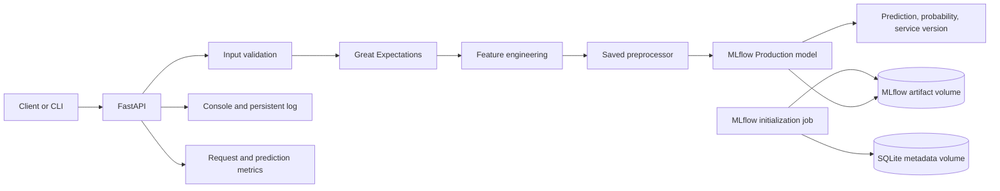

# Qafza Task 3: Olist Late Delivery Inference Service

## 1. Introduction and Project Goal

In Task 2, I trained a model to predict whether an Olist order would arrive late. In Task 3, I packaged the selected model as an inference service. A client submits order information; the service validates it, builds prediction-time features, and returns a class prediction with its late probability.

This project performs inference only. Training and threshold selection remain part of Task 2. At prediction time, the service loads the saved model and fitted preprocessor. It does not retrain the model or fit encoders and scalers again.


## 2. System Architecture



Docker Compose defines three services: `mlflow`, `mlflow-init`, and `api`. MLflow stores metadata in SQLite in the `mlflow_db` volume and artifacts in `mlflow_artifacts`. The initialization job registers the model and assigns the `Production` alias before the API starts. API logs use the `api_logs` volume. The Compose file does not define a separate PostgreSQL service.

## 3. Project Structure

The standalone Task 3 repository contains the inference service, runtime artifacts, tests, and all nine Olist CSV datasets.

```text
olist-late-delivery-mlops-task3/
├── app/main.py                 # FastAPI routes, schemas, startup, logging, metrics
├── artifacts/                  # Inference model and supporting files
├── config/config.yaml          # Model, threshold, paths, logging, monitoring
├── data/                       # All nine Olist CSV datasets
├── docs/
│   ├── Task3_Report.md
│   └── Task3_Report.pdf
├── olist db/
│   └── olist_geolocation_dataset.csv  # Path mounted by Compose for inference
├── requirements/
│   ├── requirements-prod.txt
│   └── requirements-dev.txt
├── src/                        # Inference, features, validation, MLflow, monitoring
├── tests/                      # Unit, data, CLI, monitoring, and API tests
├── .github/workflows/ci.yml
├── docker-compose.yml
├── Dockerfile
└── README.md
```

The geolocation CSV appears in `data/` as part of the full dataset and at `olist db/olist_geolocation_dataset.csv` because the existing Compose configuration mounts that path into the API container. The model, fitted preprocessor, threshold, feature list, and results summary are included in `artifacts/`.

## 4. Inference Flow

1. `POST /predict` accepts one order; `POST /predict-batch` accepts an array of orders.
2. Pydantic checks request fields, types, and basic constraints such as nonnegative values.
3. `validate_order` checks required fields, numbers, states, and timestamps.
4. Great Expectations checks input columns, numeric bounds, allowed states, and required non-null values. Invalid input returns an error and is not sent to the model.
5. `build_features` creates time and geography features, including `estimated_delivery_days`, `approval_delay_hours`, `distance_km`, and `same_state`.
6. `prepare_features` loads the saved Task 2 preprocessor and calls `transform`; it does not call `fit`.
7. The API loads the registered MLflow model through the `Production` alias.
8. `predict` calculates the `Late` probability and applies threshold `0.35` to return `Late` or `On Time`.
9. The service logs the input, prediction, latency, and service version.

Experiment 2 uses 20 raw features; the preprocessor expands them to 84 processed features. I compared inference output with the saved Task 2 test features on one test row. The maximum feature difference was `0`; the difference in model probability was also `0`.

## 5. Configuration and Versions

Runtime settings are centralized in `config/config.yaml`.

| Setting | Value | Use |
|---|---:|---|
| Model name | `logistic_regression` | Name returned by the service |
| Service version | `1.0.0` | Version returned with predictions |
| Classification threshold | `0.35` | Separates `Late` from `On Time` |
| Late-prediction baseline | `0.27448` | Reference for monitoring |
| Minimum prediction count | `100` | Minimum before checking drift |
| Drift deviation threshold | `0.10` | Absolute change of 10 percentage points |
| Log file | `logs/predictions.log` | Inference log path |

The inference artifacts and complete dataset are included in this repository, so a DVC remote is not required to clone and run this standalone Task 3 project.

## 6. MLflow and Docker Compose

`src/mlflow_tracking.py` creates a run in the `Olist Late Delivery - Experiment 2` experiment. It records the model type, experiment name, feature counts, threshold, Task 2 metrics, preprocessor, threshold configuration, and feature list. It registers the model as `olist_late_delivery_model` and assigns `Production` to the latest version.

During validation, the registry showed model version `5` under `Production`. The API reports `1.0.0` as its service version; that differs from the MLflow model version. The API loaded the model from the registry, its logs showed artifact downloads, and `olist-mlflow` reported a healthy state.

With Docker Desktop running, start the project from its root:

```powershell
docker compose up -d --build
docker compose ps -a
docker compose logs --tail=100 mlflow
```

Use `--build` for the first run or after changing the Dockerfile or dependencies. Later starts can use `docker compose up -d`. Avoid removing Docker volumes during routine restarts because they contain MLflow metadata, artifacts, and API logs.

Health and model information are available at:

```powershell
Invoke-RestMethod http://localhost:8000/health
Invoke-RestMethod http://localhost:8000/model-info
Invoke-RestMethod http://localhost:8000/metrics
```

Interactive API documentation is at `http://localhost:8000/docs`; the MLflow UI is at `http://localhost:5000`.

## 7. API and CLI Examples

A single prediction request has this shape:

```json
{
  "item_count": 1,
  "total_price": 100.0,
  "total_freight": 20.0,
  "payment_count": 1,
  "total_payment": 120.0,
  "payment_installments": 1,
  "unique_products": 1,
  "average_product_weight": 500.0,
  "average_product_photos": 3.0,
  "customer_state": "SP",
  "seller_state": "SP",
  "customer_zip_code_prefix": 1000,
  "seller_zip_code_prefix": 1100,
  "order_purchase_timestamp": "2018-01-01 10:00:00",
  "order_approved_at": "2018-01-01 10:30:00",
  "order_estimated_delivery_date": "2018-01-10"
}
```

Send it to `POST /predict`. The response observed during validation was:

```json
{
  "prediction": "Late",
  "late_probability": 0.5122373483411538,
  "model_version": "1.0.0"
}
```

`POST /predict-batch` accepts a JSON array such as `[order1, order2]`; it does not expect an object with an `orders` field. I sent the same order twice and confirmed that the response contained two predictions.

The CLI accepts a JSON file or standard input. Example using standard input inside the API container:

```powershell
Get-Content .\order.json -Raw | docker compose exec -T api python -m src.cli -
```

## 8. Logging and Monitoring

The API writes Python logging messages to the console and to `logs/predictions.log` in the `api_logs` volume. Each prediction log includes the input, prediction and probability, latency, and service version.

The `/metrics` endpoint reports request count, errors, error rate, average response time, and the split between `Late` and `On Time`. `prediction_drift` compares the observed late-prediction rate with the baseline. It waits for at least 100 predictions and reports drift when the absolute difference exceeds `0.10`.

I documented sustained error rates above 5% or average latency above one second as values to review. Metrics counters are held in memory and reset when the API restarts. The log file persists in the Docker volume.

## 9. Tests and CI/CD

Tests under `tests/` cover validation, features, prediction, CLI, monitoring, and API behavior. The following local checks were run:

```powershell
ruff check app src tests
ruff format --check app src tests
pytest -q
```

The recorded result was `28 passed`. `docker compose config --quiet` also succeeded, and live health, OpenAPI, single-prediction, and batch-prediction checks returned HTTP 200. Some scikit-learn artifacts were saved with version `1.9.0`, while the test environment used `1.9.1`; prediction and tests succeeded with this warning.

The `.github/workflows/ci.yml` workflow runs lint, formatting checks, and pytest on pushes and pull requests to `main` and `master`. After tests pass, it builds and pushes a GHCR image for pushes to those branches. The workflow file is present, but I have not confirmed a successful GitHub Actions run.

## 10. Local Setup

To run without Docker, create a virtual environment and install production and development requirements:

```powershell
python -m venv .venv
.\.venv\Scripts\Activate.ps1
python -m pip install -r requirements/requirements-prod.txt -r requirements/requirements-dev.txt
```

Run local checks with:

```powershell
ruff check app src tests
ruff format --check app src tests
pytest -q
```

For the complete service, use Docker Compose from the repository root. See `README.md` for the quick start, `config/config.yaml` for runtime settings, and `docker-compose.yml` for service and volume definitions.

## 11. Summary and Completion Status

The project packages the Task 2 model as an inference service. The API validates requests and returns predictions and probabilities; the CLI supports file and standard-input requests. The repository also includes MLflow tracking and model registry, tests, Docker Compose, logging, monitoring, and all nine Olist CSV datasets.

I verified inference against one Task 2 test row, ran 28 tests, checked the Compose configuration, and confirmed the live API endpoints during validation. I will review the latest GitHub Actions run before final submission and describe the workflow as successful only after a green run appears in GitHub.